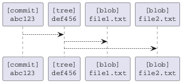
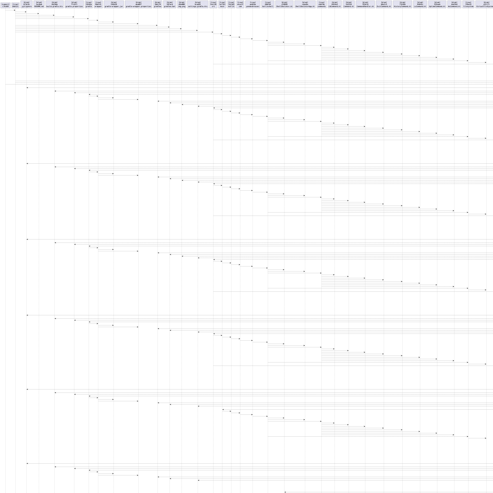
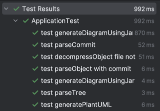

# Git Dependency Visualizer

This project is a **Git Dependency Visualizer** written in Kotlin. It parses a Git repository's structure (commits, trees, blobs) and generates a dependency graph in PlantUML format. Additionally, it generates a UML diagram using the PlantUML JAR file.

## Features

- Parses Git objects (commits, trees, blobs) from a specified repository.
- Generates a PlantUML file representing the repository's dependency graph.
- Uses the PlantUML JAR file to generate UML diagrams (e.g., PNG).
- Supports configurable paths and settings via a YAML configuration file.

## Requirements

- **JDK 11 or higher**
- **Gradle** (for building and testing)
- **PlantUML JAR file** (downloadable from [PlantUML](https://plantuml.com/download))
- A valid Git repository

## Installation

1. Clone the repository:
   ```bash
   git clone https://github.com/your-username/git-dependency-visualizer.git
   cd git-dependency-visualizer
   ```

2. Download the PlantUML JAR file and place it in your desired location.

3. Edit the configuration file (`config.yaml`) located in `src/main/resources/`:
   ```yaml
   plant_uml_path: /path/to/plantuml.jar
   repository_path: /path/to/your/git/repository
   start_date: "2023-01-01"
   branch: main
   uml_output_path: /path/to/output/diagram.png
   ```

   - `plant_uml_path`: Path to the PlantUML JAR file.
   - `repository_path`: Path to the Git repository to analyze.
   - `start_date`: Start date for filtering commits (if applicable).
   - `branch`: Git branch to analyze.
   - `uml_output_path`: Path to the output UML diagram (e.g., PNG).

4. Build the project:
   ```bash
   ./gradlew build
   ```

## Usage

1. Run the application:
   ```bash
   ./gradlew run
   ```

2. The program will:
   - Parse the Git repository specified in `config.yaml`.
   - Generate a PlantUML file (`graph.puml`) in the root directory.
   - Use the PlantUML JAR file to create a UML diagram at the location specified in `uml_output_path`.

## Testing

To run the test suite:

```bash
./gradlew test
```

Test results can be found in `build/reports/tests/test/index.html`.

## Project Structure

```
src/
├── main/
│   ├── kotlin/
│   │   └── Application.kt        # Main application logic
│   ├── resources/
│       └── config.yaml           # Configuration file
└── test/
    └── kotlin/
        └── ApplicationTest.kt    # Unit tests
```

## Example Output

### Sample `graph.puml`:



### Generated UML Diagram:



## Tests


